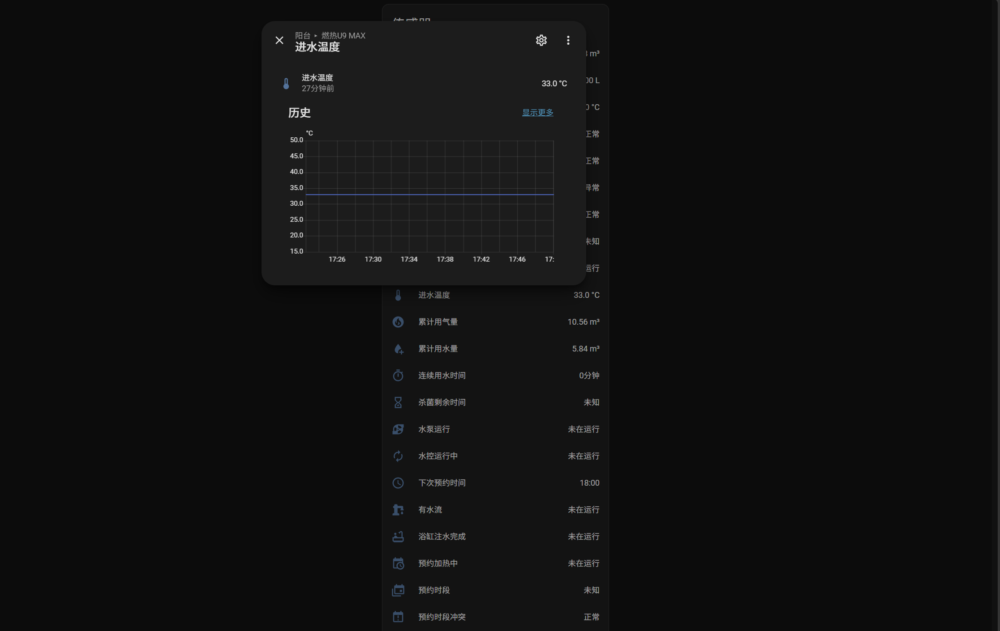

# Wanjiale Control

适用于 Home Assistant 的万家乐智能燃气热水器集成。

## 功能截图

## 特性

- 局域网 + 云端控制：优先走设备局域网端口，失败自动回退云端长连接
- 尽可能对齐官方应用的控制与状态解析
- 目前只实现燃气热水器

## 安装

方式一：

1. 将 `custom_components/wanjiale_control` 放入 Home Assistant 的 `config/custom_components/` 目录；

2. 重启 Home Assistant；

3. 「设置 → 设备与服务 → 添加集成」搜索 `Wanjiale Control`；

4. 输入万家乐应用的账号与密码。

   

方式二：

hacs中添加本仓库为自定义源

依赖：`pycryptodome`、`requests`。

## 已知限制

- 部分功能未在真机中测试，目前仅燃热 U9 MAX 的功能经过测试
- 预约时段只能只读展示：HA 没有原生的「时间窗计划」实体，而协议侧增删改需要成对的
  起止时间参数，多端写入易冲突。因此预约时段以传感器形式展示（含「下次预约时间」），编辑请仍用官方应用。
- 故障文案仅覆盖 U9 MAX：故障文案只收录了 `U9 MAX`，其他机型显示故障码。
- 状态位证据不一：UV 杀菌、冷气泡水的状态位仅来自单一机型，未在真机验证。
- 报警类点位的取值判据：部分报警点位只有数值范围、没有取值枚举，
  因此这两项只以「原始值」传感器呈现（`CO状态(原始值)` / `堵塞条件(原始值)`），不做告警判断，
  避免异常误报。
- 部分点位无法解析：水压/气压/电压/风压/水阀仅 6 个机型上报，部分参数值在不同机型上语义不一致
  （环境修正值 / CO 预警超时）以及预热/排气/防冻均未能解析。

