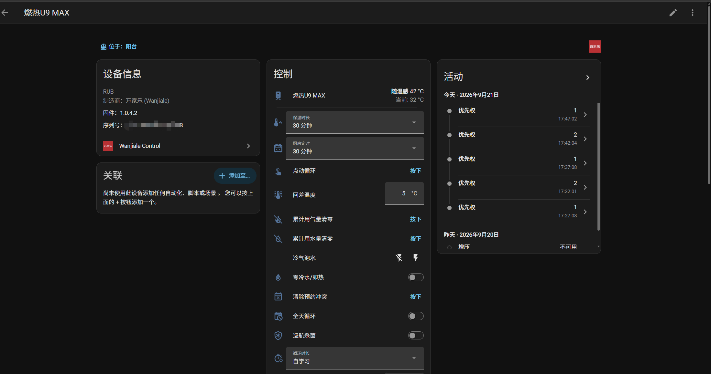
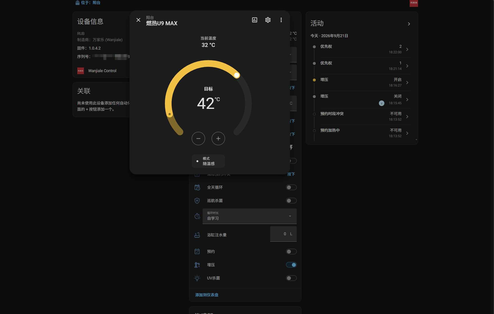

[](https://github.com/hacs/integration)
[](https://github.com/april00x/Wanjiale_Control/releases/latest)
[](https://github.com/april00x/Wanjiale_Control/stargazers)
[](https://github.com/april00x/Wanjiale_Control/issues)

# Wanjiale Control

把万家乐智能燃气热水器接入 Home Assistant。

- 局域网+官方云平台连接
- 开关机、设定温度、模式切换、零冷水、增压、杀菌、预约等控制
- 用水用气统计与故障代码提示





***❗注意：本集成依赖 `pycryptodome` 与 `requests`***

⭐如果本集成对你有所帮助，请不吝为它点个星，这将是对我的极大激励。

## 支持范围

| 品类 | 状态 | 实体文档 |
| --- | --- | --- |
| 燃气热水器 | 已支持，U9 MAX 实测 | [water_heater.md](doc/water_heater.md) |
| 电热水器/油烟机 / 灶具 / 消毒柜等 | TODO | — |

## 功能

### 控制

| 类型 | 内容 |
| --- | --- |
| 主实体 | 开关机、设定温度、模式切换 |
| 开关 | 零冷水/即热、增压、全天循环、UV杀菌、巡航杀菌、预约、冷气泡水 |
| 数值 | 回差温度 3~15℃、浴缸注水量 60~500L |
| 档位 | 保温时长、循环时长、厨房定时 |
| 动作 | 点动循环、累计用水量清零、累计用气量清零、清除预约冲突 |

模式列表取自机型模板与实机上报，可能包括舒适浴、随温感、儿童浴、老人浴、ECO、SUR、厨房洗。温度上限随模式变化：ECO 最高 48℃，随温感按环境修正量推算，其余模式 30~60℃。

### 状态

| 类型 | 内容 |
| --- | --- |
| 用水用气 | 本次与累计的用水量、用气量 |
| 水温 | 当前水温、进水温度、水量档位、当前水流量 |
| 运行状态 | 加热中、有水流、水泵运行、水控运行中、浴缸注水完成 |
| 告警 | 即热报警、预约时段冲突、放水状态 |
| 倒计时 | 连续用水时间、即热剩余时间、杀菌剩余时间 |
| 故障 | 故障代码，正常显示「正常」，异常显示 E0 / En / F3 等短码 |
| 预约 | 下次预约时间、预约时段（只读） |

## 安装

#### 方式一：[HACS](https://hacs.xyz)（推荐）

> HACS > 右上角菜单 > 自定义存储库 > 地址填 `https://github.com/april00x/Wanjiale_Control` > 类别选「集成」 > 搜索 `Wanjiale Control` > 下载

#### 方式二：手动

> 将 `custom_components/wanjiale_control` 整个目录复制到你的 `config/custom_components/`

完成后重启 Home Assistant。

***❗注意：登录名就是账号手机号，多端操作权抢占会用到它；IMEI 可以留空***

## 配置

集成卡片 > 配置，可进入选项页：

| 选项 | 说明 |
| --- | --- |
| 多端操作权抢占 | 默认关闭。开启后每次控制前会先用登录手机号抢占设备操作权，对应官方 App 的多端互斥机制。机型不校验这一项则无需开启 |
| 强制开启的功能 | 未探测到也创建实体 |
| 强制关闭的功能 | 机型模板声明支持也不创建，用于去掉误判或不需要的功能 |


## 说明

- **机型适配**：实体按「机型能力表 」适配
- **通信**：控制优先走局域网，失败回退云端；状态查询反过来，云端优先，失败走局域网，两者互不影响
- **轮询**：状态刷新间隔 10 秒，控制下发后先按预期值更新界面，2 秒后再拉真实状态校正
- **设备发现**：通过局域网广播自动发现设备地址与端口，不需要手动设置固定 IP

## 注意事项

***❗注意：「累计用水量清零」与「累计用气量清零」是一次性动作，点下去立即下发，无法撤销。Home Assistant 的按钮实体不支持弹出确认框，操作前请确认***

## 调试

要打开调试日志输出，在 configuration.yaml 中做如下配置

```yaml
logger:
  default: warn
  logs:
    custom_components.wanjiale_control: debug
```

集成详情页还提供「下载诊断信息」，可导出一份 JSON 快照（含机型能力判定依据、原始与解析后状态、连接情况），账号与设备标识已自动脱敏。

## 常见问题

- **实体比预期少？** 集成按机型能力创建实体，如有缺漏的请反馈。
- **预约时段只能看不能改？** HA 没有原生的时间窗实体，改预约又要成对写起止时间，多端同时写容易冲突，所以只读，要改请用官方 App。
- **需要给设备设固定 IP 吗？** 不需要。集成通过局域网广播自动发现设备。
- **设备显示离线？** 云端状态推送有延迟时不会立刻判定离线，会参考最近一次成功交互的时间（官方的APP也不稳定）。

## 已知限制

- 只在燃热 U9 MAX 上完整测过，其他机型部分功能未在真机验证
- 故障文案只收录了 U9 MAX，其他机型只显示故障码
- UV杀菌、冷气泡水的状态位只在一个机型上发现过，未在真机确认
- CO状态、堵塞条件只有数值范围没有取值枚举，只作为原始值显示，不做告警判断，避免误报
- 水压、气压、电压、风压、水阀只有少数机型会上报，跨机型含义不一致，暂时未能解析

## 支持我的工作

觉得有用的话，点个 Star 就是对项目最大的支持。

也欢迎反馈你手上的机型，帮助补全机型能力表和故障文案。

## 声明

本项目为非官方集成，与万家乐官方无任何关联，仅供学习与家庭自用。接口可能随官方调整而失效，使用本集成产生的任何后果由使用者自行承担。
